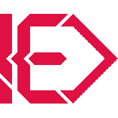

# not-ed.com / not-ed.github.io

This repository contains the content for my website, which is hosted at the domains listed below through GitHub Pages:

* not-ed.com
* not-ed.github.io

# Resources / Materials
## Site Design
Prologue (Modified) [(HTML5 UP!)](https://html5up.net/prologue)

## Fonts
* Ubuntu [(Google Fonts)](https://fonts.google.com/specimen/Ubuntu)
* Fira Sans [(Google Fonts)](https://fonts.google.com/specimen/Fira+Sans)
* Font Awesome 5 [(Font Awesome)](https://fontawesome.com/)

## Site Colors

### Accent / Logo Color
